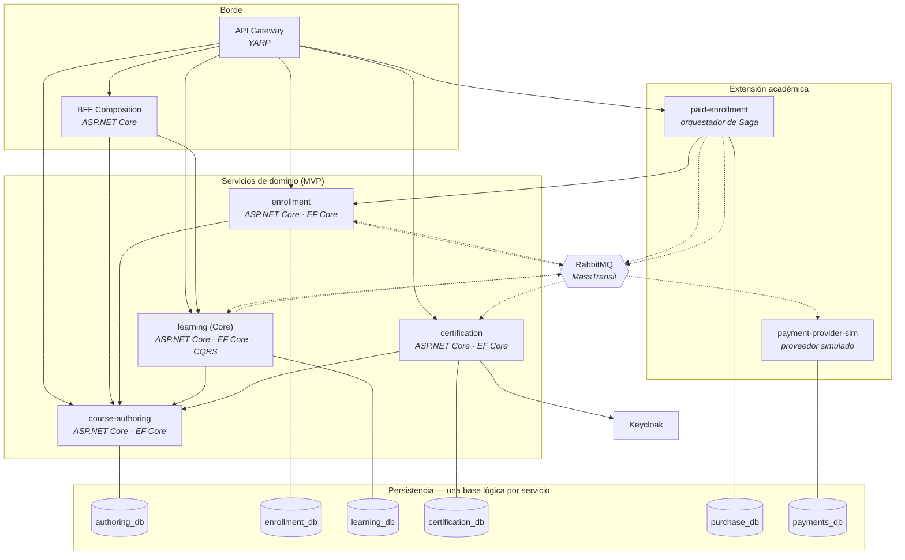
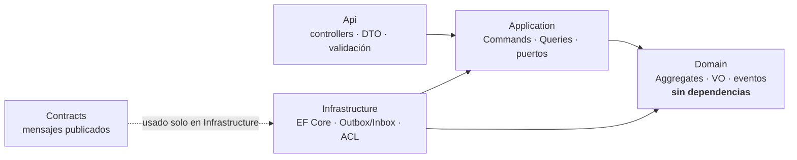

# C4 — Nivel 2: Contenedores

**Propósito:** unidades desplegables, sus tecnologías y persistencias.
**Audiencia:** desarrolladores y evaluadores. **Criterio académico:** Curso 1 (arquitectura), Curso 3 (cloud-native).

## Estructura interna de cada servicio (Clean Architecture)

## Notas

- Ningún servicio accede a la base de otro. **No hay tablas compartidas ni joins entre servicios.**
- Un tipo de `Contracts` **no puede salir de Infrastructure/ACL**.
- Building blocks compartidos: solo técnicos (mensajería, observabilidad, web, testing).
