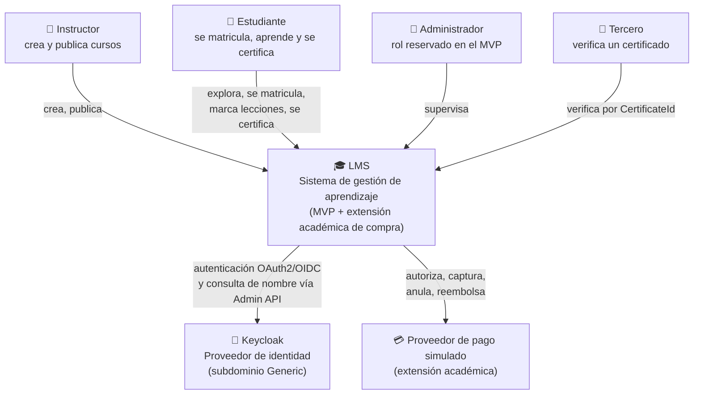

# C4 — Nivel 1: Contexto

**Propósito:** situar el sistema entre sus actores y sistemas externos.
**Audiencia:** evaluadores y personas no técnicas. **Criterio académico:** Curso 1 (arquitectura general).

## Notas

- **Keycloak no es un Bounded Context de negocio**: es el proveedor de identidad (Generic).
- El **proveedor de pago es simulado** y pertenece **solo** a la extensión académica.
- La **verificación de certificados es pública**: no requiere autenticación, solo el `CertificateId`,
  y devuelve exclusivamente los datos congelados mínimos.
