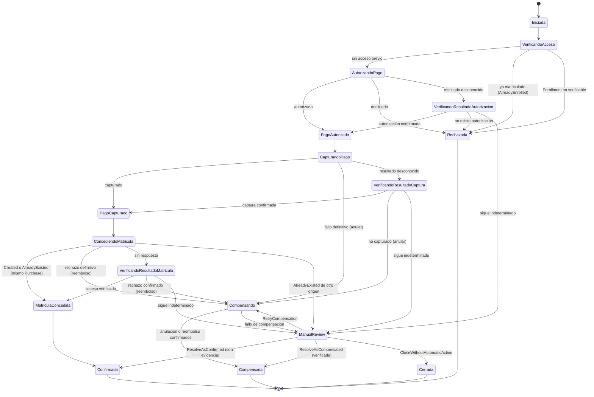
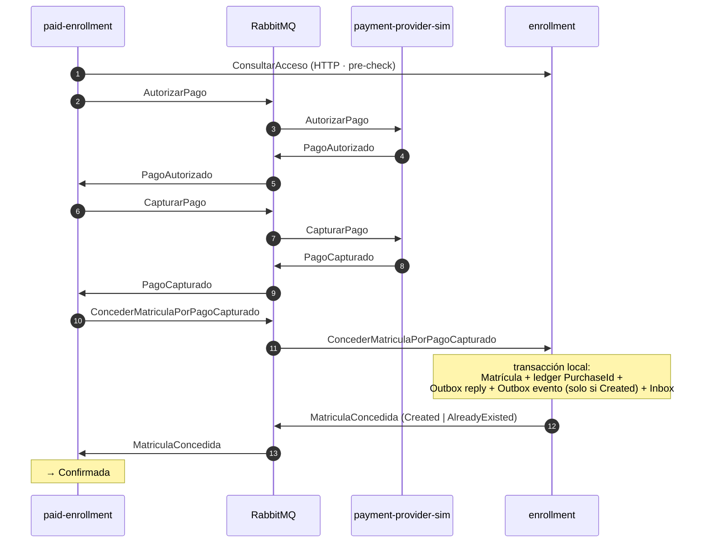

# Saga — Compra de Acceso a Curso (extensión académica)

**Propósito:** documentar la máquina de estados, las reconciliaciones y las compensaciones.
**Criterio académico:** Curso 2 (Saga, estados, compensaciones, consistencia eventual).

> ⚠️ **Extensión académica.** El **flujo gratuito del LMS no es una Saga** y no depende de esta.
> La Matrícula es el **último paso irreversible** y **nunca se revierte**.

## Máquina de estados

## Mensajes (todos con consumidor real)

## Reglas de la Saga

| Regla | Aplicación |
|---|---|
| Antes de pagar se verifica el acceso | un estudiante ya matriculado **no vuelve a pagar** |
| Antes de capturar se autoriza | `AutorizandoPago` → `CapturandoPago` |
| **Fallo antes de captura** | **anulación** de la autorización |
| **Fallo después de captura** | **reembolso** |
| **Resultado desconocido** | **se reconcilia antes de compensar** (tres estados de verificación) |
| **Nunca se reembolsa** mientras el resultado de la Matrícula sea desconocido | `VerificandoResultadoMatricula` |
| Una Matrícula válida **no se revierte** | es el último paso, sin compensación posterior |
| **`ManualReview` no es terminal** | espera resolución; **toda respuesta tardía se registra** |
| Acceso de otro origen | **`ManualReview`**, nunca `Confirmada` automática |

`ResolveAsConfirmed` **solo** es válido si: el pago fue capturado · no existe reembolso · el ledger
corresponde al mismo `PurchaseId` · la Matrícula fue creada por esa compra o es un reintento de ella.
