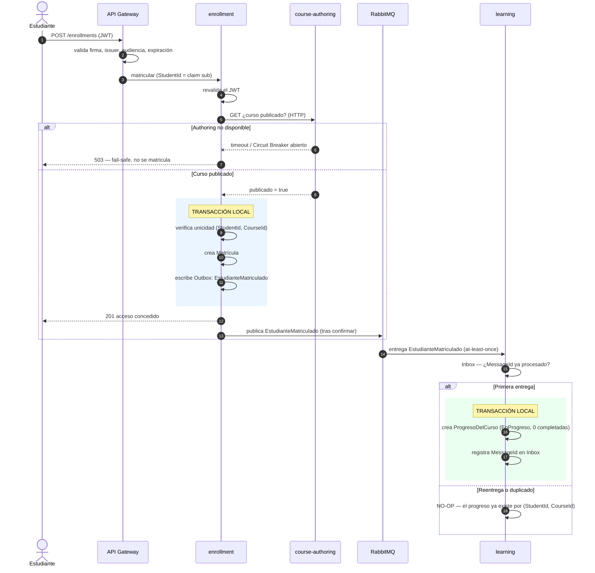

# Flujo Enrollment → Learning

**Propósito:** mostrar la coreografía EDA del flujo gratuito con transacción local, Outbox, broker,
Inbox y comportamiento ante duplicados.
**Criterio académico:** Curso 2 (EDA, consistencia eventual, idempotencia).

> Este flujo es **coreografía EDA**, **no una Saga**: sus hechos son irreversibles y no admiten
> compensación legítima.

## Garantías

| Aspecto | Mecanismo |
|---|---|
| Entrega | **at-least-once** (el broker puede repetir) |
| Deduplicación de transporte | **Inbox por `MessageId`** |
| Idempotencia de negocio | clave natural **`(StudentId, CourseId)`** |
| Efecto observable | **effectively-once** |
| Fallo de Learning | el acceso **ya está concedido**; nada se revierte; se reintenta la entrega |
| Ventana temporal | el estudiante tiene acceso pero aún no puede marcar lecciones (**riesgo aceptado nº 1**) |
