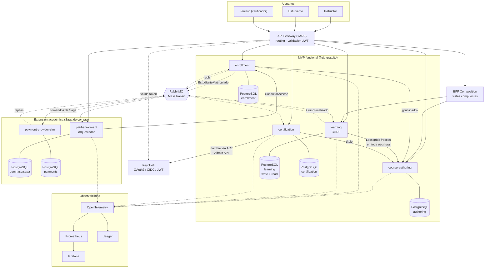

# Diagrama general de arquitectura

**Propósito:** visión completa del sistema con tecnologías, límites y tipos de comunicación.
**Audiencia:** evaluadores y desarrolladores. **Criterio académico:** Curso 1 (diagrama general), Curso 3 (cloud-native).

Línea continua = **HTTP síncrono** · línea discontinua = **mensajería RabbitMQ**.

## Notas

- **No se publican al broker:** `CursoPublicado`, `ContenidoPublicadoModificado`, `LecciónCompletada`,
  `CertificadoEmitido`, `PurchaseConfirmada`, `PurchaseCompensada` (sin consumidor obligatorio).
- **Solo dos Integration Events** gobiernan procesos en el MVP: `EstudianteMatriculado` y `CursoFinalizado`.
- El **flujo gratuito no depende** de la extensión académica.
- Cada servicio posee **su propia base lógica**; no hay acceso cruzado.
