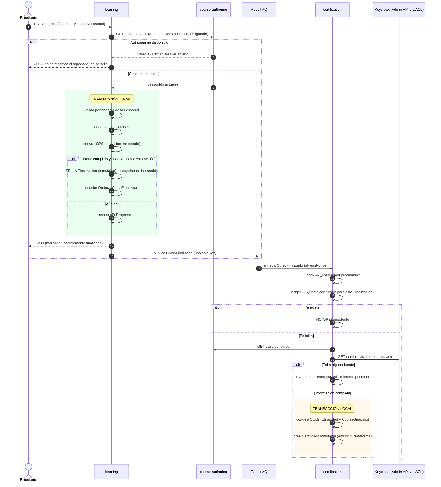

# Flujo Learning → Certification

**Propósito:** mostrar el conjunto fresco de `LessonIds`, el sellado de la Finalización, la
propagación y la emisión del certificado con reintento si falta información.
**Criterio académico:** Curso 2 (EDA, idempotencia), Curso 1 (resiliencia).

## Reglas visibles

- **`LessonIds` frescos en toda escritura**: la caché solo se usa en consultas y se marca como aproximada.
- La **Finalización es inmutable** y `CursoFinalizado` se produce **una sola vez**.
- El certificado **nace solo con información completa**; la fecha procede de la Finalización y el
  nombre y el título se **congelan al emitir**.
- **`CertificadoEmitido` no se publica**: no tiene consumidor en el MVP.
- Si la propagación falla, **la Finalización no se revierte**: se reintenta la entrega.
