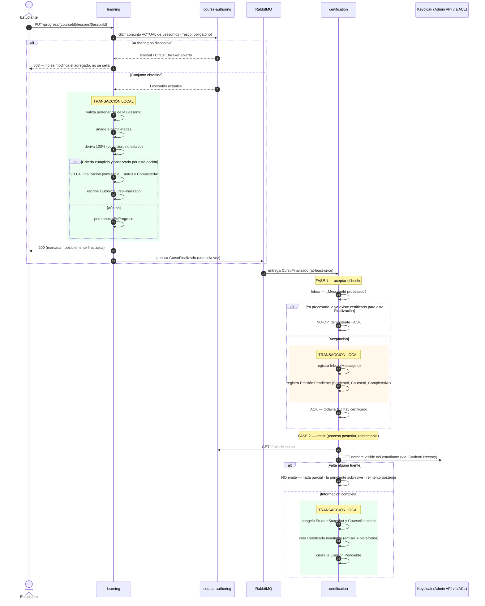

# Flujo Learning → Certification

**Propósito:** mostrar el conjunto fresco de `LessonIds`, el sellado de la Finalización, la
propagación y la emisión del certificado con reintento si falta información.
**Criterio académico:** Curso 2 (EDA, idempotencia), Curso 1 (resiliencia).

## Reglas visibles

- **`LessonIds` frescos en toda escritura**: la caché solo se usa en consultas y se marca como aproximada.
- **El sellado no persiste ningún snapshot de `LessonIds`**: sella `Status` y `CompletedAt`, y nada
  más (ver [ADR-T27](../adr/ADR-T27-no-lesson-set-snapshot.md)). El conjunto publicado pertenece a
  Authoring y no forma parte del estado del agregado.
- La **Finalización es inmutable** y `CursoFinalizado` se produce **una sola vez**.
- **Aceptar el hecho y emitir el certificado son dos fases distintas.** El Inbox afirma que el evento
  fue aceptado y convertido en trabajo interno durable, **no** que el certificado exista. Eso permite
  confirmar el mensaje sin emitir, sin perder el hecho y sin bloquear la cola mientras una fuente
  esté caída.
- El certificado **nace solo con información completa**; la fecha procede de la Finalización y el
  nombre y el título se **congelan al emitir**. Si falta alguna fuente, la **emisión pendiente
  sobrevive** y se reintenta después, sin intervención manual.
- El nombre visible se obtiene siempre a través del puerto `IStudentDirectory`. Su fuente definitiva
  es Keycloak Admin API vía ACL ([ADR-T15](../adr/ADR-T15-keycloak-security.md)); hasta ese
  incremento lo satisface un adaptador **provisional**
  ([ADR-T26](../adr/ADR-T26-provisional-student-directory.md)).
- **`CertificadoEmitido` no se publica**: no tiene consumidor en el MVP.
- Si la propagación falla, **la Finalización no se revierte**: se reintenta la entrega.
